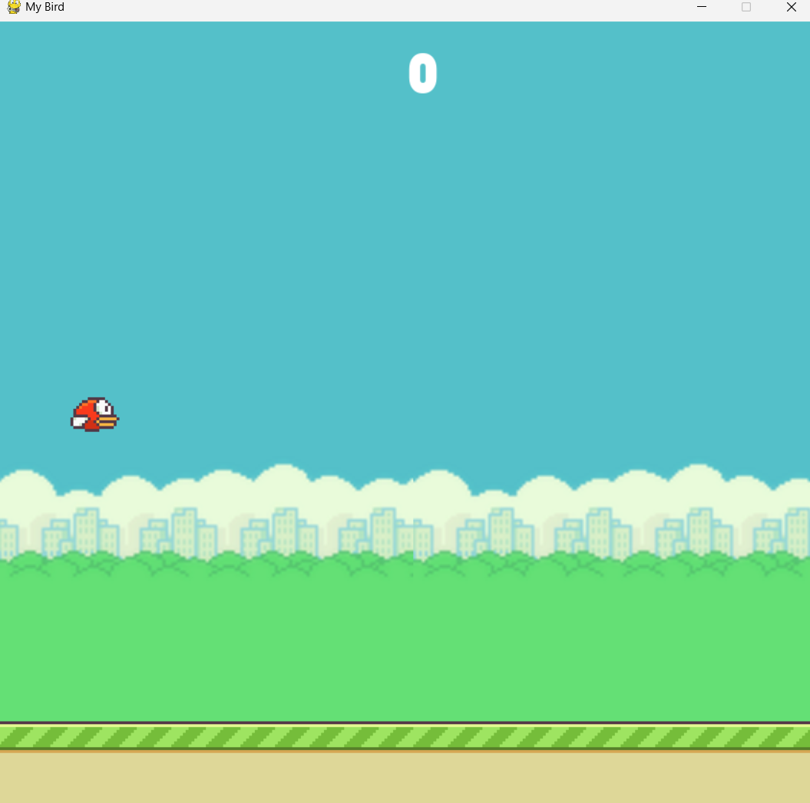
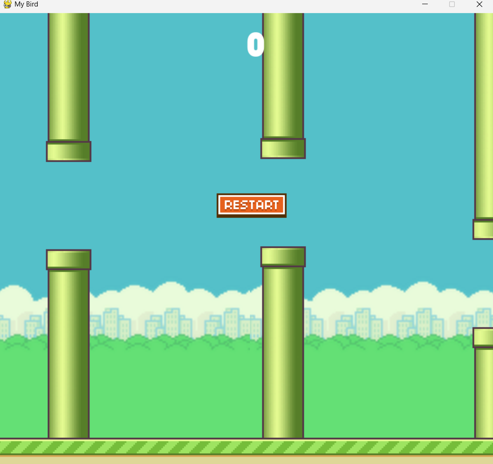

# 🕊️ Flappy Bird (Python + Pygame)

A modern recreation of the classic **Flappy Bird** game built using **Python** and **Pygame**.  
This project demonstrates clean code structure, smooth animations, and responsive gameplay physics.

---

## 🎮 Features
- Smooth bird animations and gravity-based physics  
- Randomized pipe generation for endless gameplay  
- Score tracking and restart option  
- Sound effects for jump, collision, and scoring  
- Simple and readable code — perfect for beginners  

---

## 🧠 Tech Stack
- **Language:** Python  
- **Library:** Pygame  

---

## 🚀 Run the Game

### 1️⃣ Clone the repository
```bash
git clone https://github.com/sherlock2215/Flappy_Bird.git
cd Flappy_Bird
```

### 2️⃣ Install dependencies
```bash
pip install pygame
```

### 3️⃣ Run the game
```bash
python main.py
```

---

## 🖼️ Screenshots

| Gameplay | Game Over |
|-----------|------------|
|  |  |


---

## 📂 Project Structure

```
Flappy_Bird/
│
├── assets/             # Images, sprites, and sounds
├── main.py             # Main game logic
├── README.md           # Project documentation
└── requirements.txt    # Python dependencies
```

---

## 📜 License
This project is licensed under the [MIT License](LICENSE).

---

## 🧑‍💻 Author
**[Sherlock2215](https://github.com/sherlock2215)**  
🎯 Passionate about Python, Game Dev, and Cybersecurity.

---

## ⭐ Support
If you like this project, please **⭐ star the repo** — it helps others discover it!

---
